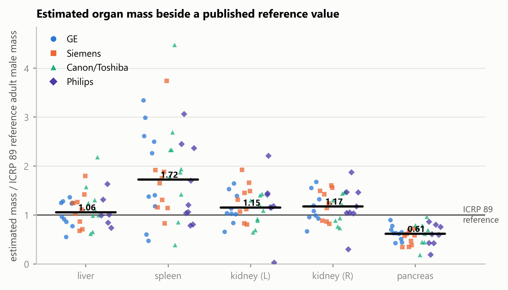
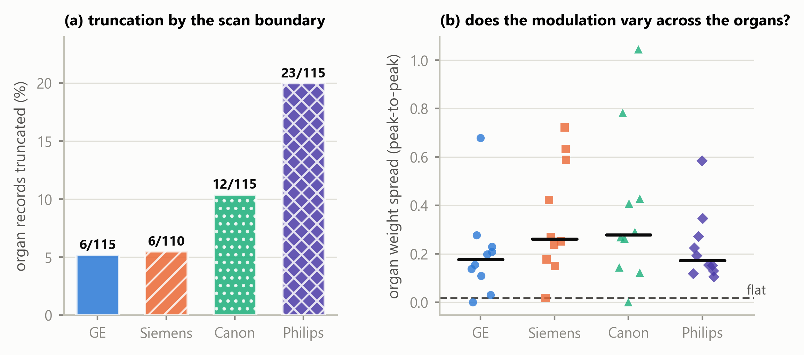

<!--
MDPI *Tomography* — Article (regular submission, single-blind; author identity retained).
Every quantity is re-derived from results/analysis_1.5mm.json by
tests/test_manuscript_consistency.py; no number in this document is typed by hand.
-->

# Anatomy-Weighted CTDIvol from Routine CT Metadata: A Patient-Specific, Multi-Vendor Study Using Deep-Learning Segmentation

**Shuji Yamamoto**

Institute of One, LISIT Co., Ltd., Tokyo, Japan; yamamoto@lisit.jp; ORCID 0000-0001-9211-1071

**Correspondence:** yamamoto@lisit.jp

## Abstract

CTDIvol is a scanner-output index, not a patient or organ dose, and cannot express how
longitudinal tube-current modulation varies along a patient. We characterised
longitudinal tube-current modulation at the organ level by deriving an anatomy-weighted
CTDIvol index from routine DICOM metadata and automated organ segmentation; the index is
not an estimate of absorbed organ dose. Forty abdominal CT series, ten from each of four
manufacturers, were drawn from The Cancer Imaging Archive, and twelve organs segmented
with TotalSegmentator at inference only. Of 480 organ–series combinations, 455 records
were produced, the remainder organs outside the scanned range; 408 were untruncated and
386 admitted an index. Modulation weights spanned 0.59 to 1.69, so the index departs from
the whole-scan CTDIvol by up to 70% within one acquisition. A recorded CTDIvol was retained in the archived headers
of 29 of 40 series, was reconstructable in 5 and unavailable in 6; availability differed
markedly between manufacturers in this sample. Estimated organ mass was broadly consistent
with ICRP 89 reference values for liver and kidneys, with pancreas and spleen offsets
explored rather than empirically corrected. Conversion to absorbed organ dose requires
Monte-Carlo coefficients this index does not replace. The implementation is open and
reproducible.

**Keywords:** computed tomography; CTDIvol; tube-current modulation; deep-learning
segmentation; TotalSegmentator; image-based dosimetry indices; reproducibility; open data

## 1. Introduction

Two different things are routinely conflated when CT dose is discussed. The first is that
a *dose index* is not a *dose*: CTDIvol describes the output of a scanner into a standard
cylinder of acrylic, and is a property of the acquisition rather than of the patient in
it. The second is that a single value per series cannot express variation along the
patient: almost every modern acquisition modulates the tube current longitudinally, so
the exposure conditions over the liver and over the bladder are not the same, and one
number for the series conceals that.

The information needed to describe the second is already in the file. The per-slice tube
current is written into the image header as X-Ray Tube Current (0018,1151). What has been
missing is not the exposure record but the anatomy: to weight the recorded current by an
organ's own longitudinal extent, one must know where that organ lies, slice by slice, in
that patient. Manual contouring of a dose-relevant organ set across a multi-vendor cohort
has never been practical at scale.

Deep-learning segmentation removes that obstacle. A general-purpose segmenter such as
TotalSegmentator [1] produces abdominal organ masks from a routine series in seconds on a
consumer GPU, at inference only. The anatomy is now effectively free.

This study therefore constructs an **anatomy-weighted CTDIvol index**: the whole-scan
CTDIvol scaled by a dimensionless, organ-specific weight formed from the recorded
per-slice tube current over that organ's segmented longitudinal extent. The index
quantifies organ-specific longitudinal modulation relative to the whole-scan value. It is
explicitly *not* an estimate of absorbed organ dose, and Section 2.9 sets out what it does
not account for.

Converting an index of this kind into an absorbed organ dose in milligray requires
CTDIvol-normalised organ-dose coefficients, computed by Monte-Carlo simulation over
anthropomorphic phantoms and corrected for patient size [2,3]. Such coefficient sets
exist, are well validated, and are in routine use; the index reported here does not
replace them and is not offered as a surrogate for their output.

The contributions are:

1. An anatomy-weighted CTDIvol index computed entirely from data a scanner already
   records, implemented as an openly licensed, provenance-carrying engine.
2. A quantification of organ-specific longitudinal modulation across four manufacturers,
   including its range within single acquisitions.
3. A description, for this archive sample, of how often the required inputs are actually
   retained in archived DICOM headers.
4. An external reference comparison of attenuation-derived estimated organ mass against
   ICRP 89 reference values [5].
5. The practical limits an organ-level modulation analysis must handle: organ truncation
   at the scan boundary, and acquisitions whose modulation does not vary across the
   abdomen.

## 2. Materials and Methods

### 2.1. Data Selection Without Bulk Download

Handing a collection manifest to a bulk downloader fetches an entire collection, which for
the low-dose CT collection is of the order of 600 GB, most of it raw projection data
irrelevant to this work. We therefore used a metadata-first procedure over the public NBIA
REST API with four stages — index, screen, probe, download — in which only the last
transfers a series.

The candidate index was built from 47,181 CT series across 21 abdominal collections, read
as series-level JSON with no pixel data. Candidates were seeded from the public-archive
survey distributed with the companion software release [6] and supplemented by direct
collection queries. A metadata screen then rejected, in order and with each rejection
counted: non-patient collections (imaging phantoms and de-identification benchmarks);
projection and raw-data series, of which 398 were refused at this stage; non-diagnostic
series (localisers, dose reports, screen captures); series shorter than 40 or longer than
1200 images; and series outside the abdomen. One series was retained per patient per
collection, and each manufacturer's quota was drawn round-robin across its collections so
that manufacturer was not confounded with a single collection.

### 2.2. Inclusion Criteria and Header Probing

Sixty-two surviving candidates were probed by fetching six image headers each and judged
on four requirements: per-slice tube current present on *every* probed slice; that current
genuinely modulated (peak-to-peak over mean at least 0.02, so header rounding is not
mistaken for modulation); a defined Hounsfield rescale; and a reconstructed-image SOP
class with at least 40 slices spanning at least 120 mm. Forty series were kept, ten per
manufacturer.

No imaging is redistributed. Each retained series is identified in the shipped provenance
record by collection, collection DOI, Series Instance UID, manufacturer, model, licence
and retrieval date. All forty series were retrieved under Creative Commons Attribution
licences — 33 under CC BY 4.0 and 7 under CC BY 3.0, as recorded per series in
`data/PROVENANCE.json`; users must in every case observe the licence terms of the
originating collection and the TCIA Data Usage Policy.

### 2.3. Resolving the Slice Grid

Organ volume is a voxel count multiplied by a voxel volume, so slice spacing multiplies
every volume and every mass estimate. Two properties of archived series make the obvious
calculation wrong, and both are silent.

First, the file count is not always the position count. One series in this cohort contains
160 images at 119 distinct longitudinal positions; taking the spacing as the extent
divided by the number of images gives 3.71 mm where the true spacing is 5.0 mm, and
stacking the duplicated images repeats anatomy so that organs occupy more slices than they
physically do. We therefore resolve the grid explicitly: one image per position, spacing
from the median step between neighbouring positions, and a uniformity check that refuses a
series whose steps vary by more than 2%. Two series proved to be a pair of reconstructions
interleaved under a single Series Instance UID; for these the largest regular sub-grid was
taken, accepted only when it preserves the full longitudinal extent.

Second, the ordering of the slice axis is not guaranteed. Slice Location (0020,1041) runs
opposite in sign to Image Position (Patient) on three of the four manufacturers in this
sample, so a series sorted by the former arrives head-first. The segmentation is
unaffected, because the geometry handed to the segmenter is built from patient
coordinates; but the array index ceases to mean "towards the head", which reverses every
reported organ extent. Volumes are therefore canonicalised so that index zero is the most
inferior slice, with the tube current reordered alongside, since *I(z)* is paired to the
slice axis by index.

### 2.4. Reading Hounsfield Units

Outside the reconstruction circle an image carries a padding value rather than a
measurement, and that value must be replaced with air before anything is measured. Pixel
Padding Value (0028,0120) has a value representation that depends on Pixel Representation,
and this is not reliably honoured: in this sample one export writes 63,536 with an
unsigned representation on signed pixel data, which is the two's complement encoding of
the −2000 intended. Read literally, that places the padding threshold above every
Hounsfield value in the image, and the volume becomes uniform air. Four series were
affected, with no symptom other than a segmenter returning empty masks. We reinterpret the
padding value against Pixel Representation, and additionally refuse any padding rule that
would blank essentially the whole image.

### 2.5. Segmentation

Twelve abdominal organs were segmented with TotalSegmentator v2.17 [1], `total` task, 1.5
mm full-resolution model, at inference only; no weights were trained, modified or
redistributed. Inference runs in a separate child process, because nnU-Net spawns its own
workers and doing so from a long-lived parent leaks processes on Windows.

The series is written to NIfTI by our own code, with an affine constructed from the DICOM
patient coordinates, and the masks return on that same grid; the correspondence between
mask voxel and image voxel is therefore the identity by construction, and is asserted
rather than assumed. A mirrored segmentation would otherwise produce entirely plausible
volumes and Hounsfield values while pairing every organ with the wrong anatomy.

The patient outline, used for the water-equivalent diameter, was taken from a
deterministic threshold contour following AAPM Report 220 [7].

### 2.6. Attenuation-Derived Estimated Organ Mass

Hounsfield units were converted to mass density by piecewise-linear interpolation through
reference tissue anchor points, taking the densities from ICRU Report 44 [8] and the
construction from Schneider et al. [9]. Estimated organ mass is the sum of local density
over mask voxels multiplied by the voxel volume.

These are **model-based estimates, not measurements**. Contrast enhancement, tube voltage,
reconstruction kernel and scanner-specific HU calibration may all affect
attenuation-derived density estimates, and none was controlled in this archive cohort:
contrast phase in particular varies between and within collections. The reported masses
should therefore be interpreted as model-based estimates rather than physical ground
truth. The HU-to-density curve itself is replaceable and travels into the provenance of
every estimate; abdominal soft tissue is relatively insensitive to the choice, since
perturbing the water-to-muscle slope by 10% changes an abdominal organ-mass estimate by
less than 1%.

### 2.7. The Anatomy-Weighted CTDIvol Index

For an organ *o* occupying slices with per-slice voxel counts *n_o(z)*, and a series with
per-slice tube current *I(z)*, the organ-specific modulation weight is

*w_o* = [ Σ_z *n_o(z) I(z)* / Σ_z *n_o(z)* ] / mean_z *I(z)*     (1)

and the anatomy-weighted CTDIvol index is CTDIvol · *w_o*. The weight is dimensionless and
is the transferable quantity: it expresses the organ's longitudinal exposure conditions
relative to the scan mean, independently of the scanner's own output.

CTDIvol was taken from the image header (0018,9345) where present. Where absent, it was
reconstructed from acquisition physics against an openly licensed normalised-CTDI database
[4]; recorded and reconstructed values are never merged, and each series records which it
carries. A recorded value outside the physically possible range is treated as a corrupt
attribute and falls through to reconstruction — one series records CTDIvol as
−3.7 × 10^19 mGy.

An organ whose mask reaches the first or last slice of the series continues beyond the
scan; its estimated mass is that of the scanned part and its weight describes only the
exposed part. Such organs are flagged and excluded from whole-organ comparisons.

### 2.8. Organ Record Flow

Forty series and twelve requested organs give 480 organ–series combinations. Records were
produced for 455. The remaining 25 are organs that lay outside the scanned longitudinal
range, so their masks were empty and no record exists: urinary bladder in 10 series,
gallbladder in 8, and seven further organs in a single 41-slice pelvic acquisition that
does not reach the upper abdomen. Of the 455 records, 408 are untruncated, and 386 carry
an anatomy-weighted index; the remaining 69 records, from 6 series, carry a modulation
weight but no index, because those series have no CTDIvol by either route. The external
reference-mass comparison uses the 177 untruncated records of the five solid organs. The
full flow is in the shipped `results/analysis_1.5mm.json`.

### 2.9. What the Index Does and Does Not Represent

The anatomy-weighted CTDIvol index describes organ-specific *longitudinal* tube-current
modulation relative to the whole-scan CTDIvol. It does not account for scattered
radiation; irradiation originating outside the organ's segmented longitudinal extent;
angular (in-plane) tube-current modulation; organ depth, position or attenuation;
patient-specific Monte-Carlo radiation transport; or absorbed organ dose in milligray. It
is therefore not a surrogate for absorbed organ dose and must not be read as one. What it
does provide is a dimensionless, patient-specific, organ-specific measure of longitudinal
modulation, and a derived index in the units of the parent CTDIvol.

### 2.10. Verification and Reproducibility

Every series is screened against facts of gross anatomy that hold for any adult: the left
kidney lies to the patient's left of the right kidney and the spleen to the left of the
liver; the liver lies superior to the bladder and the adrenal glands superior to the
kidneys; solid-organ mass estimates fall within a wide band of reference values; and the
organ weights vary within a series. These screens exist because the failures they catch
leave no other trace.

Analyses were run with Python 3.14 (the package supports 3.10 and later), TotalSegmentator
v2.17 (`total` task, 1.5 mm model) on PyTorch 2.11 with CUDA 12.8, pydicom 3.0 and NumPy
2.5. Every reported value is re-derived from the per-series records by the test suite,
including regenerating the complete analysis table and comparing it. Tables and figures are
regenerated by `tools/make_analysis.py` and `tools/make_figures.py`; the acquisition and
organ layers by `tools/select_and_download.py` and `tools/run_organ_dose.py`.
`TODO-AUTHOR:` insert the release tag, commit hash and Zenodo version DOI at submission.

## 3. Results

### 3.1. Cohort and Records

Forty series were analysed — ten from each of GE, Siemens, Canon/Toshiba and Philips —
drawn from 21 collections and 23 scanner models. Of 480 organ–series combinations, 455
organ records were produced across 12 organs, with the flow as given in Section 2.8.

### 3.2. Organ-Specific Modulation Weights

Organ-specific modulation weights across the cohort span 0.59 to 1.69. The
anatomy-weighted index therefore departs from the whole-scan CTDIvol by up to roughly 70%
in either direction within a single acquisition, which is the variation the index exists
to express.

Figure 3 shows one acquisition end to end: a Canon/Toshiba Aquilion PRIME series of 268
slices with a recorded CTDIvol of 16.1 mGy and a scan mean tube current of 265 mA. The
small bowel and colon, lying in the inferior abdomen where the modulation raised the
current to about 447 and 435 mA, take weights of 1.69 and 1.64 respectively, giving indices
near 27 mGy; the left kidney and stomach, higher in the scan, take weights of 0.94 and
indices near 15 mGy. Two organs in the same acquisition thus differ by a factor of 1.8 in
their anatomy-weighted index, a difference no whole-scan value can express.

{width=100%}

**Figure 3.** One acquisition end to end. (**a**) Each organ's longitudinal extent,
annotated with the mean tube current recorded over it, against a scan mean of 265 mA.
(**b**) The resulting anatomy-weighted CTDIvol index, with the organ-specific modulation
weight beside each bar; the dashed line is the whole-scan CTDIvol of 16.1 mGy. The bars
are modulation-weighted indices, not absorbed doses.

### 3.3. Availability of a Dose Index in the Archived Headers

Across the cohort, 29 of 40 series retained a recorded CTDIvol in the archived DICOM
headers, 5 were reconstructable from acquisition physics, and 6 were neither (Figure 2).

All 6 unrecoverable series are GE, and none of the ten sampled GE series retained a
recorded CTDIvol in the archived headers; the other three manufacturers retained one in 29
of 30. These counts are reported descriptively. No significance test is applied: series
drawn from a curated archive are not independent with respect to collection, contributing
site, scanner model, export pathway or de-identification, and a p-value computed over that
structure would describe a sampling model the data do not satisfy. For the six
unrecoverable series the organ masks, volumes, mass estimates and modulation weights are
all computable and reported, but no anatomy-weighted index exists for them.

{width=100%}

**Figure 2.** Availability of a whole-scan dose index in the archived DICOM headers, by
manufacturer, in this TCIA sample. A series counted unrecoverable retained no CTDIvol in
its header and its scanner lies outside the open coefficient database. Segments are
distinguished by fill pattern as well as tone.

### 3.4. External Reference Comparison of Estimated Organ Mass

Table 1 and Figure 1 place attenuation-derived estimated organ mass beside the ICRP 89
reference adult male values [5], over the 177 untruncated records of the five solid
organs.

**Table 1.** Attenuation-derived estimated organ mass beside ICRP 89 reference adult male
values, untruncated organs only. The reference is an external anchor, not a subject-level
ground truth.

| organ | n | median estimated mass | ratio to ICRP 89 |
|---|---|---|---|
| liver | 34 | 1901 g | 1.06 |
| spleen | 38 | 259 g | 1.72 |
| kidney (left) | 34 | 179 g | 1.15 |
| kidney (right) | 35 | 182 g | 1.17 |
| pancreas | 36 | 86 g | 0.61 |

Estimates for the liver were broadly consistent with the reference value, within 6%, and
the kidneys within 17%. Two organs departed more substantially: the pancreas estimate was
39% below the reference and the spleen 72% above. Neither was adjusted; possible
explanations are examined in Section 4.

{width=100%}

**Figure 1.** Attenuation-derived estimated organ mass relative to the ICRP 89 reference
adult male mass, by manufacturer. Each marker is one organ in one series; the horizontal
bar is the median across all manufacturers. Organs truncated by the scan boundary are
excluded. Manufacturer is encoded by marker shape as well as colour, so the figure is
readable in greyscale.

### 3.5. What Limits an Organ-Level Modulation Analysis

Two conditions reduce what such an analysis can measure, and both differ across the
sampled manufacturers (Figure 4).

Truncation by the scan boundary affected 5.2% of organ records on GE, 5.5% on Siemens,
10.4% on Canon/Toshiba and 20.0% on Philips, reflecting the scan ranges of the sampled
acquisitions rather than any property of the scanners. The organs most often cut are the
colon and small bowel.

3 of the 40 series showed a peak-to-peak spread of organ weights below 0.02: their tube
current does not vary across the abdominal organs, so the weighting has nothing to
express. These series passed the modulation screen at selection, where the current varies
across the whole scan; the flatness is local to the abdomen. They are uninformative for
this analysis rather than faulty.

{width=100%}

**Figure 4.** What limits an organ-level modulation analysis. (**a**) Percentage of organ
records truncated by the scan boundary, by manufacturer, annotated with the counts.
(**b**) Peak-to-peak spread of the organ-specific modulation weights within each series;
the dashed line is the threshold below which a series carries no usable variation.

## 4. Discussion

**Principal finding.** Organ-specific modulation weights span 0.59 to 1.69 across this
cohort, and within a single acquisition two organs differed by a factor of 1.8 in their
anatomy-weighted index. Longitudinal modulation therefore produces organ-specific exposure
conditions that a single whole-scan CTDIvol cannot represent, and the magnitude is large
enough to matter for any organ-level analysis built on that value.

**Interpretation.** The weight is a direct, dimensionless summary of how the recorded tube
current was distributed over an organ's own longitudinal extent in that patient. It
requires no phantom, no simulation and no additional acquisition — only metadata the
scanner already writes and a segmentation obtained at inference.

**What the index is, and what it is not.** As set out in Section 2.9, the index addresses
longitudinal modulation alone. It does not account for scatter, for irradiation
originating outside the organ's segmented extent, for angular modulation, for organ depth
and attenuation, or for radiation transport, and it is not an estimate of absorbed organ
dose in milligray. Its value lies in isolating one well-defined contribution — the
longitudinal one — and reporting it patient-specifically and reproducibly.

**External reference comparison of estimated mass.** Liver and kidney estimates were
broadly consistent with ICRP 89 reference values, which is the expected behaviour if the
segmentation and the density model are working. The pancreas estimate sits 39% below the
reference. The pancreas is the weakest of these organs in TotalSegmentator's own
validation (Dice 0.887, against 0.965 for the liver, 0.983 for the spleen and 0.953 and
0.939 for the kidneys [1]), which supports reduced boundary agreement; but Dice is
symmetric and does not establish the *direction* of a disagreement, so it does not by
itself demonstrate under-segmentation. Contrast phase, reconstruction kernel and genuine
anatomical variation in this cohort are alternative contributors that the present design
cannot separate. The source of the discrepancy cannot be determined without subject-level
reference contours or clinical ground truth.

The spleen estimate sits 72% above the reference. The four largest cases — 4.47, 3.74,
3.34 and 3.06 times the reference value — were reviewed slice by slice against their own
images: each contour follows the splenic boundary with correct laterality, tracks the notch
at the hilum, shows no leakage into liver, kidney or stomach, and forms a single connected
component, so no accessory spleen was included. Their mean densities, 1.052 to 1.078
g/cm³, are unremarkable for splenic tissue, so the elevation arises from segmented volume
rather than from the density model; and the spleen is the best-segmented of these organs
in the segmenter's validation. The cases arise on four different manufacturers. The cohort
is oncological — renal cell, colorectal and adrenal carcinoma — in which splenomegaly is
common, and the ICRP reference adult is not that population. The observed elevation was
most consistent with cohort anatomy among the explanations examined, although
subject-level pathological confirmation was unavailable.

**Availability in archived headers, and its confounders.** In this sample, availability of
a recorded CTDIvol differed markedly with manufacturer. This is an observation about
archived DICOM headers in one curated archive, not a statement about scanner
implementations. The present design cannot distinguish between scanner implementation,
scanner generation, acquisition site, DICOM export pathway, PACS processing,
de-identification, archive curation and collection composition as the origin of a missing
attribute; several of these are confounded with manufacturer through collection
membership. The practical consequence stands regardless of cause: a retrospective
organ-level analysis drawn from an archive will lose a manufacturer-associated fraction of
its cohort before segmentation is considered, and a study that does not report which
series were lost will under-represent that manufacturer silently.

**Reproducibility and open implementation.** The engine is MIT-licensed, no imaging is
redistributed, and every reported value is re-derived from the per-series records by an
automated test suite that regenerates the analysis tables and compares them. The
acquisition procedure, the analysis and the figures are each a single command.

**The boundary to absorbed organ dose.** Converting an anatomy-weighted index into an
absorbed organ dose requires CTDIvol-normalised coefficients with a patient-size
correction, of the kind established by Turner et al. [2] and extended over larger patient
model libraries by Tian et al. [3], together with the transport considerations listed in
Section 2.9. Those coefficient sets are published in subscription journals or distributed
with research software under terms granting use but not redistribution, which reflects a
publishing convention for Monte-Carlo reference data rather than any deficiency in the
coefficients themselves. Normalised-CTDI data of the kind used here to reconstruct a
missing whole-scan index has been published under CC BY [4], which shows the convention is
movable. The software accordingly refuses to emit a dose in milligray unless supplied with
a coefficient table carrying its citation, DOI, licence and source hash.

**Limitations.** Ten series per manufacturer supports a median and an interquartile range,
not a distributional claim, and series within the archive are not independent with respect
to collection, site, scanner model or export pathway. The cohort is oncological and not a
reference population. Contrast phase, tube voltage and reconstruction kernel were not
controlled, and all affect attenuation-derived mass estimates. A single segmentation model
was used, so segmentation behaviour and cohort anatomy cannot be separated. There is no
subject-level ground truth for organ mass. The index addresses longitudinal modulation
only, as set out in Section 2.9, and no absorbed dose is reported.

**Future work.** Coefficients computed with an open-source Monte-Carlo engine would carry
no licensing constraint and would permit the transport terms this index omits; an
independent segmentation model on the same series would separate segmentation behaviour
from cohort anatomy for the pancreas and spleen; and a larger archive cohort would allow
the availability observation to be examined with collection and site modelled explicitly
rather than confounded.

## 5. Conclusions

This study did not compute absorbed organ dose. It quantified organ-specific longitudinal
tube-current modulation in routine abdominal CT by deriving an anatomy-weighted CTDIvol
index from metadata a scanner already records and organ masks obtained at inference.
Organ-specific modulation weights spanned 0.59 to 1.69, and two organs within one
acquisition differed by a factor of 1.8 in their index, so the variation a single
whole-scan value conceals is substantial. The approach ran across four manufacturers with
openly licensed inputs throughout, and in this archive cohort the availability of the
whole-scan CTDIvol the index scales varied markedly between manufacturers, which
constrains any retrospective analysis of this kind. The index is a step before conversion
to absorbed organ dose, not a substitute for it: that conversion requires Monte-Carlo
coefficients and the transport terms this index omits. The implementation is open,
provenance-aware and reproducible from the shipped results.

## Author Contributions

S.Y.: conceptualisation, methodology, software, validation, formal analysis,
investigation, data curation, writing — original draft, writing — review and editing,
visualisation. The author has read and agreed to the published version of the manuscript.

## Funding

This research received no external funding.

## Institutional Review Board Statement

Not applicable. This study used only publicly available, de-identified imaging from The
Cancer Imaging Archive.

## Informed Consent Statement

Not applicable. This study used only publicly available, de-identified imaging from The
Cancer Imaging Archive.

## Data Availability Statement

The software supporting this study, `ctsegdose-core`, is openly available under the MIT
licence at https://github.com/Institute-of-One/ctsegdose-core and archived at Zenodo
(`TODO-AUTHOR:` version DOI, release tag and commit hash to be inserted at submission).
The machine-readable results the manuscript quotes, the per-organ records, the analysis
tables and the figure scripts are included in that repository, together with the
mask-review overlays underlying Section 4.

No DICOM imaging is redistributed. Every series analysed is identified in
`data/PROVENANCE.json` by collection, collection DOI, Series Instance UID, manufacturer,
model, licence and retrieval date, and is retrievable directly from The Cancer Imaging
Archive by following `docs/REPRODUCING_DATA.md`. The forty series were retrieved under
Creative Commons Attribution licences (33 under CC BY 4.0, 7 under CC BY 3.0) as recorded
per series; the licence terms of each originating collection and the TCIA Data Usage
Policy apply.

Segmentation used TotalSegmentator [1]. Its software code is distributed under the Apache
2.0 licence, and the `total` task model weights used here are likewise stated by the
project to be openly available under Apache 2.0; other tasks in that project require a
separate licence and were not used. No model weights are redistributed with this work.

No organ-dose coefficient table is redistributed, for the licensing reasons set out in
Section 4.

## Conflicts of Interest

The author is the representative of LISIT Co., Ltd. (Tokyo, Japan) and Chief Executive
Officer of TexelCraft OÜ (Estonia), and has a commercial interest in downstream products
that may incorporate or build upon the methods described here. The software reported in
this article is released under the MIT licence. No patient data, customer data or
proprietary clinical data were used; all imaging is publicly available and de-identified.

## Use of Generative Artificial Intelligence

A generative artificial intelligence assistant (Claude, Anthropic) was used as a tool in
the development of the software and in drafting and editing the text of this manuscript.
All reported results are produced by executable code contained in the cited repository,
are re-derived from the underlying per-series records by an automated test suite, and were
verified by the author. All scientific judgements, interpretations and conclusions are the
author's, who takes full responsibility for the content of this article.

## References

1. Wasserthal, J.; Breit, H.-C.; Meyer, M.T.; Pradella, M.; Hinck, D.; Sauter, A.W.; Heye,
   T.; Boll, D.T.; Cyriac, J.; Yang, S.; Bach, M.; Segeroth, M. TotalSegmentator: Robust
   Segmentation of 104 Anatomic Structures in CT Images. *Radiol. Artif. Intell.* **2023**,
   *5*, e230024. https://doi.org/10.1148/ryai.230024
2. Turner, A.C.; Zhang, D.; Khatonabadi, M.; Zankl, M.; DeMarco, J.J.; Cagnon, C.H.; Cody,
   D.D.; Stevens, D.M.; McCollough, C.H.; McNitt-Gray, M.F. The Feasibility of Patient
   Size-Corrected, Scanner-Independent Organ Dose Estimates for Abdominal CT Exams. *Med.
   Phys.* **2011**, *38*, 820–829. https://doi.org/10.1118/1.3533897
3. Tian, X.; Li, X.; Segars, W.P.; Frush, D.P.; Paulson, E.K.; Samei, E. Dose Coefficients
   in Pediatric and Adult Abdominopelvic CT Based on 100 Patient Models. *Phys. Med. Biol.*
   **2013**, *58*, 8755–8768. https://doi.org/10.1088/0031-9155/58/24/8755
4. Dinwiddie, L.E.; Baggett, J.M.; Kofler, J.M.; et al. Survey of Normalized CTDIvol Values
   Across Four Major Computed Tomography Vendors for Use in the MIRDct Software. *J. Appl.
   Clin. Med. Phys.* **2026**, *27*, e70473. https://doi.org/10.1002/acm2.70473
5. ICRP. Basic Anatomical and Physiological Data for Use in Radiological Protection:
   Reference Values. ICRP Publication 89. *Ann. ICRP* **2002**, *32* (3–4).
6. Yamamoto, S. ctsegdose-core's Companion: ctdose-core — Open, Auditable CT Dose
   Surveillance from DICOM (Software Release). Zenodo, **2026**.
   https://doi.org/10.5281/zenodo.21636082
7. McCollough, C.; Bakalyar, D.M.; Bostani, M.; Brady, S.; Boedeker, K.; Boone, J.M.;
   Chen-Mayer, H.H.; Christianson, O.I.; Leng, S.; Li, B.; et al. Use of Water Equivalent
   Diameter for Calculating Patient Size and Size-Specific Dose Estimates (SSDE) in CT: The
   Report of AAPM Task Group 220. *AAPM Report No. 220*, **2014**.
   https://doi.org/10.37206/146
8. ICRU. Tissue Substitutes in Radiation Dosimetry and Measurement. ICRU Report 44; ICRU:
   Bethesda, MD, USA, **1989**.
9. Schneider, U.; Pedroni, E.; Lomax, A. The Calibration of CT Hounsfield Units for
   Radiotherapy Treatment Planning. *Phys. Med. Biol.* **1996**, *41*, 111–124.
   https://doi.org/10.1088/0031-9155/41/1/009
