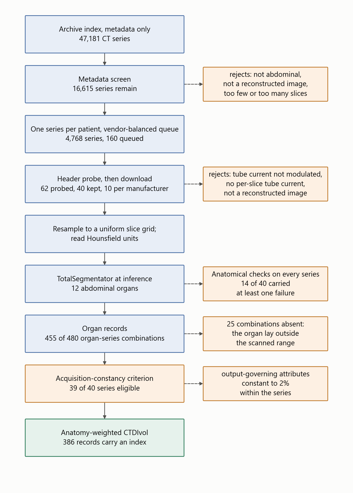
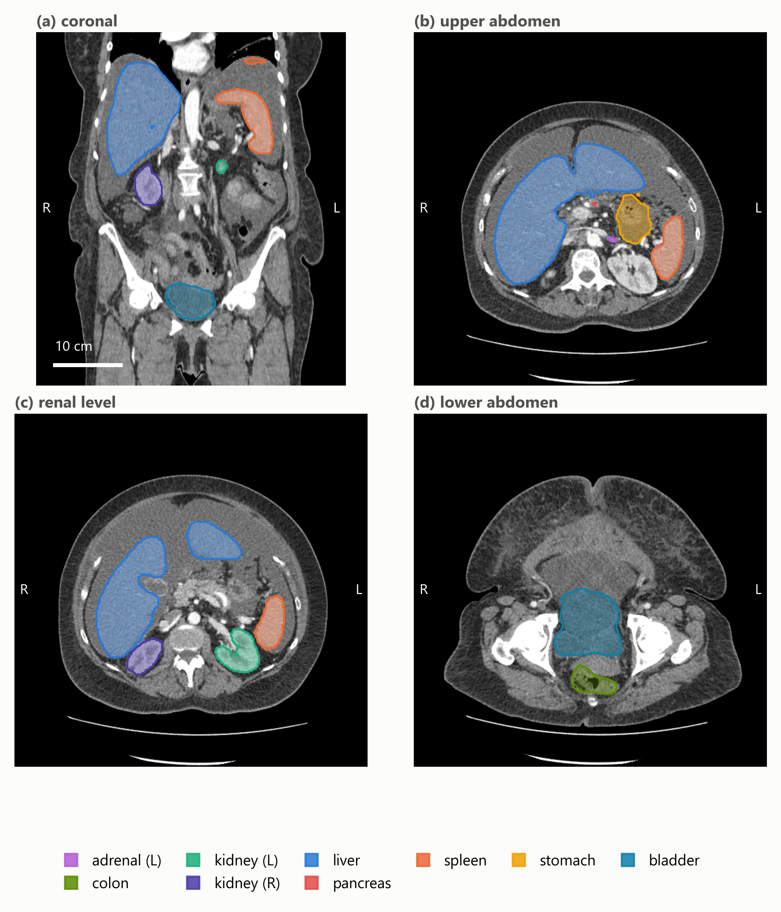
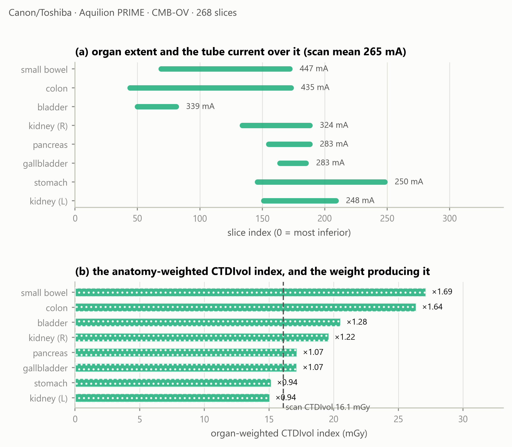
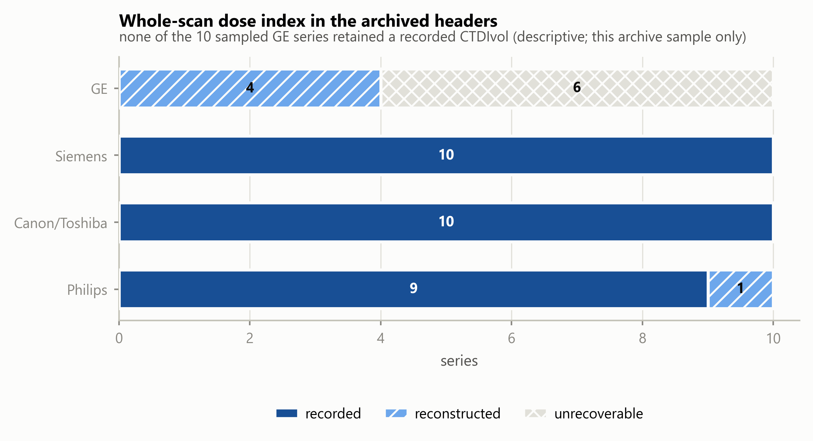
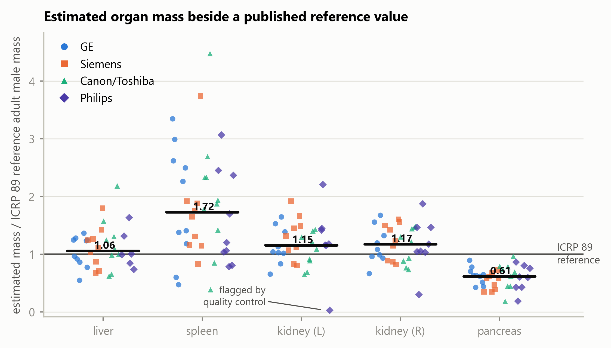

<!--
MDPI *Tomography* — Article (regular submission, single-blind; author identity retained).
Every quantity is re-derived from results/analysis_1.5mm.json by
tests/test_manuscript_consistency.py; no number in this document is typed by hand.
-->

# Anatomy-Weighted CTDIvol from Routine CT Metadata: A Patient-Specific, Multi-Vendor Study Using Deep-Learning Segmentation

**Shuji Yamamoto**

Institute of One, LISIT Co., Ltd., Tokyo, Japan; yamamoto@lisit.jp; ORCID 0000-0001-9211-1071

**Correspondence:** yamamoto@lisit.jp

## Simple Summary

CT scanners report a single dose number for the whole scan, yet the dose is delivered
unevenly across organs. We built an open, freely available software pipeline that uses
deep-learning segmentation to outline each abdominal organ on routine CT images and then
derives a patient-specific, organ-level dose *index* directly from data the scanner
already records. Across scans from four manufacturers we found that this organ-level
information can be recovered for some scanners but is entirely absent for others, because
the values it needs were not kept in the archived scan records. All software, results, and
data provenance are fully open so the work can be reproduced and extended.

## Abstract

CTDIvol is a scanner-output index, not an organ dose, and cannot express how tube-current
modulation varies along a patient. An organ-specific weighted CTDIvol addressing this has
been reported before, in single-institution cohorts and often from inputs routine archives
do not retain. New here is not the quantity but what an open, multi-vendor
operationalisation reveals: whether its inputs survive archive curation, and what the
fallback costs when they do not. Forty abdominal CT series, ten per manufacturer, were
drawn from The Cancer Imaging Archive and twelve organs segmented with TotalSegmentator at
inference. Of 480 requested organ–series combinations, 455 were produced. A rule-based
acquisition-constancy criterion admitted 39 series. Modulation weights spanned
0.59 to 1.69, so the index departs from the whole-scan CTDIvol by up to 70% within one
acquisition. A recorded CTDIvol survived in 29 of 40 archived headers, was reconstructable
in 5 and unavailable in 6, availability differing markedly between manufacturers. Forcing
that reconstruction on series that did retain a value agreed to within 12% on three
scanner models and diverged by 58% and 84% on two others. Estimated organ mass was broadly
consistent with ICRP 89 for liver and kidneys. This index is not absorbed dose; the
implementation is open.

**Keywords:** computed tomography; CTDIvol; tube-current modulation; deep-learning
segmentation; TotalSegmentator; image-based dosimetry indices; reproducibility; open data

## 1. Introduction

Two different things are routinely conflated when CT dose is discussed. The first is that
a *dose index* is not a *dose*: CTDIvol describes the output of a scanner into a standard
cylinder of acrylic, and is a property of the acquisition rather than of the patient in
it — a distinction set out explicitly by McCollough et al. [1]. The second is that a
single value per series cannot express variation along the patient: almost every modern
acquisition modulates the tube current longitudinally [2], so the conditions over the liver
and over the bladder are not the same, and one number for the series conceals that.

That second point is well established. Khatonabadi et al. demonstrated that a *regional* or
*organ-specific* CTDIvol, formed from the modulation profile over an organ's own location,
tracks Monte-Carlo organ dose far better than the whole-scan value, raising the coefficient
of determination for liver dose from 0.26 to 0.86 [3]. Tian et al. formalised a **weighted
organ-specific CTDIvol** computed from the modulation profile and used it, with organ-dose
coefficients, to predict organ dose prospectively [4].

**The quantity examined here is therefore not new, and no new index is proposed.** This
study takes the organ-specific weighted CTDIvol already reported in that literature and
asks a different question: what happens when it is operationalised openly, end to end, on
heterogeneous archived data from four manufacturers, using automated segmentation and
nothing but the metadata a scanner already writes?

Existing work only partially answers that question. Longitudinal dose indices,
DICOM-header-derived modulation profiles and TotalSegmentator-assisted dose calculations
have each been investigated, but in different settings and for different endpoints. Li et
al. characterised the size-specific dose estimate as a function of longitudinal position,
SSDE(z), under both fixed and modulated tube current [5]. Nuntue et al. derived
tube-current-modulation profiles from DICOM headers and used them, with Monte-Carlo
simulation and physical measurement, to improve absorbed organ dose estimates in abdominal
CT [6]. Eom et al. incorporated TotalSegmentator into an automated effective-dose
calculation on clinical PET/CT [7]. What remains insufficiently characterised is whether
the organ-weighting layer can be reconstructed end to end from heterogeneous archived
DICOM alone, how often the required inputs survive archive curation and de-identification,
how acquisition-parameter constancy can be verified, and how the resulting quantity
behaves across manufacturers when patient-specific contours are obtained automatically.
Deep-learning segmentation is what makes the attempt practical at scale: a general-purpose
segmenter such as TotalSegmentator [8], built on nnU-Net [9], produces abdominal organ
masks from a routine series in seconds at inference only, so the anatomy is now
effectively free.

This study is accordingly an **open, multi-vendor operationalisation and empirical
characterisation** of a previously reported quantity: the whole-scan CTDIvol scaled by a
dimensionless, organ-specific weight formed from the recorded per-slice tube current over
that organ's segmented longitudinal extent, referred to here as the anatomy-weighted
CTDIvol index. It is explicitly *not* an estimate of absorbed organ dose, and Section 2.11
sets out what it does not account for.

Converting an index of this kind into an absorbed organ dose in milligray requires
CTDIvol-normalised organ-dose coefficients, computed by Monte-Carlo simulation over
anthropomorphic patient models and corrected for patient size [4]. Such coefficient sets
exist, are well validated, and are in routine use; the index reported here does not
replace them and is not offered as a surrogate for their output.

The contributions are stated below in terms of what is computed and by what rule, since
that is where the novelty of an operationalisation lies:

1. **An end-to-end computation from archived metadata alone.** Per-slice tube current
   I(z) is read from (0018,1151) on every image; the series is resampled onto a uniform
   slice grid; twelve organ masks are obtained from a general-purpose segmenter at
   inference; each organ's longitudinal extent is taken from the extreme slices of its
   own mask; and the organ weight is the mean of I(z) over that extent divided by the
   mean over the whole series. The index is that weight times the whole-scan CTDIvol.
   Nothing in the chain requires projection data, a manual contour, or a value the
   scanner did not already write.
2. **A multi-vendor empirical characterisation of the resulting quantity** — its range,
   its within-acquisition spread and its behaviour across four manufacturers — computed
   by the same code on all series, so that between-vendor differences cannot arise from
   between-site processing.
3. **A measurement of how often the inputs survive archive curation, and of what happens
   when one of them does not.** The measurement is a direct inspection of the archived
   headers of all 40 series for the two attributes the index needs: per-slice tube
   current, and a whole-scan CTDIvol in (0018,9345). Where the second is absent it can
   sometimes be rebuilt from acquisition physics, and Section 3.5 reports how far that
   reconstruction agrees with the recorded value on the series where both can be
   obtained. What is new is the pairing: retention rates measured on a multi-vendor
   archive sample, together with the accuracy and the coverage of the fallback that the
   gaps force a retrospective study onto.
4. **A rule-based acquisition-constancy criterion** that makes the proportionality
   assumption behind the weighting testable rather than implicit: a series is admitted
   only if every attribute that governs scanner output other than tube current is
   constant within it, to a tolerance justified in Section 2.9 from the resolution at
   which those attributes are stored.
5. **An external reference comparison of attenuation-derived estimated organ mass against
   ICRP 89 values [10].** This is not a separate study but the only external check
   available to the pipeline: no ground-truth organ mass exists for archived series, and
   organ mass is the one intermediate quantity the pipeline produces that can be compared
   with a published reference at all. Agreement bounds how far the segmentation and the
   Hounsfield-to-density mapping can jointly be wrong, which is what makes the weights
   downstream of them worth reporting.

## 2. Materials and Methods

### 2.1. Data Selection Without Bulk Download

Handing a collection manifest to a bulk downloader fetches an entire collection, which for
the low-dose CT collection is of the order of 600 GB, most of it raw projection data
irrelevant to this work. We therefore used a metadata-first procedure over the public NBIA
REST API with four stages — index, screen, probe, download — in which only the last
transfers a series. Figure 1 sets out the whole pipeline: the stages of data formation,
the number of series surviving each, and the verification attached to each stage together
with what it rejects.

{width=90%}

**Figure 1.** Data formation and verification. Blue: stages that produce or transform
data, with the number of series or records carried forward. Orange: verification, each
box naming what its stage rejects or flags. Green: the reported quantity. Every count is
read from the shipped result files.

All series in this study are public, de-identified data from The Cancer Imaging Archive,
used under the individual collection licences recorded in the provenance file that
accompanies the software. The archive's submission process removes protected health
information from both headers and pixel data before publication while retaining the
attributes research requires [11], and no imaging is redistributed by this work: series
are identified by Series Instance UID, collection and licence so that any of them can be
re-fetched. The study required no ethical approval, since it uses only such data and
enrols no participants.

All imaging was drawn from The Cancer Imaging Archive [12]. The candidate index was built
from 47,181 CT series across 21 abdominal collections, read as series-level JSON with no
pixel data. Candidates were seeded from the public-archive
survey distributed with the companion software release [13] — a software record, not a
peer-reviewed study — and supplemented by direct collection queries. A metadata screen then rejected, in order and with each rejection
counted: non-patient collections (imaging phantoms and de-identification benchmarks);
projection and raw-data series, of which 398 were refused at this stage; non-diagnostic
series (localisers, dose reports, screen captures); series shorter than 40 or longer than
1200 images; and series outside the abdomen. One series was retained per patient per
collection, and each manufacturer's quota was drawn round-robin across its collections so
that manufacturer was not confounded with a single collection.

Ten series per manufacturer was chosen for what the study measures. Every quantity
reported here is a per-series or per-organ property computed by identical code, so the
comparison that matters is between organs within a patient, where each series is its own
control and 40 series yield 455 organ records. Ten per manufacturer supports a median and
an interquartile range for a manufacturer, which is what is reported, and does not support
a distributional claim about one, which is not. Nothing in the design is powered by adding
series: a larger cohort would narrow those interquartile ranges without changing what the
index is or whether its inputs survive archive curation.

The selection is not a random sample of clinical CT and cannot be treated as one. Three
stages shape it. The metadata screen keeps abdominal, diagnostic, reconstructed series of
moderate length, so unusual acquisitions are removed by construction. The probe requires
per-slice tube current recorded on every probed image and genuine modulation, which
excludes fixed-current protocols entirely and, as Section 3.3 shows, correlates with
manufacturer through what the archive retained. The collections themselves are
oncological, so body habitus and organ appearance are those of a cancer population rather
than of a screening one. The direction of each effect can be stated even though its size
cannot: the cohort is biased towards modern modulated abdominal protocols on scanners
whose archived headers are complete, which is the population in which an
anatomy-weighted index is computable at all, and the availability fractions in Section 3.3
are therefore an upper bound on what a less selective cohort would yield.

### 2.2. Inclusion Criteria and Header Probing

Sixty-two surviving candidates were probed by fetching six image headers each and judged
on four requirements: per-slice tube current present on *every* probed slice; that current
genuinely modulated (peak-to-peak over mean at least 0.02, so header rounding is not
mistaken for modulation); a defined Hounsfield rescale; and a reconstructed-image SOP
class with at least 40 slices spanning at least 120 mm. Forty series were kept, ten per
manufacturer.

No imaging is redistributed. Each retained series is identified in the shipped provenance
record by collection, collection DOI, Series Instance UID, manufacturer, model, licence
and retrieval date. All forty series were retrieved under Creative Commons Attribution
licences — 33 under CC BY 4.0 and 7 under CC BY 3.0, as recorded per series in
`data/PROVENANCE.json`; users must in every case observe the licence terms of the
originating collection and the TCIA Data Usage Policy.

### 2.3. Resolving the Slice Grid

Organ volume is a voxel count multiplied by a voxel volume, so slice spacing multiplies
every volume and every mass estimate. Two properties of archived series make the obvious
calculation wrong, and both are silent.

First, the file count is not always the position count. One series in this cohort contains
160 images at 119 distinct longitudinal positions; taking the spacing as the extent
divided by the number of images gives 3.71 mm where the true spacing is 5.0 mm, and
stacking the duplicated images repeats anatomy so that organs occupy more slices than they
physically do. We therefore resolve the grid explicitly: one image per position, spacing
from the median step between neighbouring positions, and a uniformity check that refuses a
series whose steps vary by more than 2%. Two series proved to be a pair of reconstructions
interleaved under a single Series Instance UID; for these the largest regular sub-grid was
taken, accepted only when it preserves the full longitudinal extent.

Second, the ordering of the slice axis is not guaranteed. Slice Location (0020,1041) runs
opposite in sign to Image Position (Patient) on three of the four manufacturers in this
sample, so a series sorted by the former arrives head-first. The segmentation is
unaffected, because the geometry handed to the segmenter is built from patient
coordinates; but the array index ceases to mean "towards the head", which reverses every
reported organ extent. Volumes are therefore canonicalised so that index zero is the most
inferior slice, with the tube current reordered alongside, since *I(z)* is paired to the
slice axis by index.

### 2.4. Reading Hounsfield Units

Outside the reconstruction circle an image carries a padding value rather than a
measurement, and that value must be replaced with air before anything is measured. Pixel
Padding Value (0028,0120) has a value representation that depends on Pixel Representation,
and this is not reliably honoured: in this sample one export writes 63,536 with an
unsigned representation on signed pixel data, which is the two's complement encoding of
the −2000 intended. Read literally, that places the padding threshold above every
Hounsfield value in the image, and the volume becomes uniform air. Four series were
affected, with no symptom other than a segmenter returning empty masks. We reinterpret the
padding value against Pixel Representation, and additionally refuse any padding rule that
would blank essentially the whole image.

### 2.5. Segmentation

Twelve abdominal organs were segmented with TotalSegmentator v2.17 [8], `total` task, 1.5
mm full-resolution model, at inference only; no weights were trained, modified or
redistributed.

TotalSegmentator is an nnU-Net model [9]. nnU-Net is not a fixed architecture but a
self-configuring pipeline: from the spacing, size and intensity distribution of a training
set it derives the patch size, the batch size, the pooling depth and the normalisation
scheme, and instantiates an encoder–decoder convolutional network of the U-Net family with
those settings. The self-configuration and its validation are examined further in [14]. The network used here is the three-dimensional full-resolution variant,
which processes overlapping patches of the volume and aggregates them with Gaussian
weighting, so that a voxel near a patch border is decided mainly by the patch in which it
sits centrally. The published model was trained on a corpus of computed tomography
covering 104 anatomical structures across a wide range of scanners, protocols and body
regions [8]; the twelve abdominal structures used here are a subset of its output classes.
Inference used the released weights with the default configuration, on one GPU, in a
separate child process, because nnU-Net spawns its own worker processes and doing so from
a long-lived parent leaks them on Windows.

The series is written to NIfTI by our own code, with an affine constructed from the DICOM
patient coordinates, and the masks return on that same grid; the correspondence between
mask voxel and image voxel is therefore the identity by construction, and is asserted
rather than assumed. A mirrored segmentation would otherwise produce entirely plausible
volumes and Hounsfield values while pairing every organ with the wrong anatomy.

The patient outline, used for the water-equivalent diameter, was taken from a
deterministic threshold contour following AAPM Report 220 [15]. Figure 2 illustrates the
segmentation output and its correspondence with the CT anatomy in the representative
acquisition used for the end-to-end example.

### 2.6. Segmentation Quality Control

No mask was manually corrected, and none was used without being checked. Two procedures
were applied to every series, both automated in the first instance and one of them
followed by direct inspection of the images.

The first is a set of anatomical assertions run over the completed record of all 40
series. They test properties that a correct segmentation cannot violate and an incorrect
one violates conspicuously: that the left-sided organ of each pair lies on the patient's
left; that the adrenal gland lies superior to the kidney on the same side; that each
organ's attenuation-derived mass falls inside a plausibility band around its ICRP 89
reference value [10]; and that the organ modulation weights vary between organs and
bracket the scan mean, which they must if the weighting is being applied at all to a
modulated acquisition. The first two are tripwires for the failure modes that leave no
other trace — a mirrored volume, or an inverted head–foot ordering — because both produce
masks whose volumes and Hounsfield statistics look entirely ordinary.

14 of the 40 series raised at least one flag, 28 flags in all. None was a laterality
failure and none was an inversion. The flags divide into four kinds. 10 were the weights
failing to bracket the scan mean, which the check itself reports as expected when the
acquisition extends beyond the abdomen: in a chest–abdomen–pelvis series the scan mean
includes regions no abdominal organ occupies, and the abdominal weights then sit to one
side of it. 15 were organ masses outside the plausibility band. Two were the organ
weights not varying between organs, which occurs when the tube current is effectively
constant over the abdominal extent rather than when the weighting has failed; those series
are separately excluded from the quantitative analysis by the acquisition-constancy
criterion of Section 2.10. One was a borderline superior–inferior ordering, an adrenal and
kidney centroid separated by five voxels on a series where the two structures abut.

The second procedure addresses the mass flags, because an organ mass far from its
reference value has two explanations that are indistinguishable in a table: a patient
whose organ really is that size, and a mask that has leaked into neighbouring tissue. Only
the image separates them. The organs furthest from their reference mass were rendered as
contours over their own CT at three levels each, with laterality and slice index annotated
on every panel, and inspected. The most extreme case in the cohort — a spleen of 671 g,
4.5 times the ICRP 89 reference — is a clean segmentation of a genuinely enlarged spleen
in a renal-carcinoma patient, the contour following the organ boundary at every level over
homogeneous parenchyma. The cohort is drawn from oncological collections, in which organ
enlargement is common; a plausibility band built on reference values for a healthy adult
is therefore expected to flag real anatomy, and does.

The opposite tail does not admit that explanation. The smallest mass in the cohort is a
left kidney of 4.3 g on a Philips Brilliance 64 series, segmented at 4.0 cm³ and not
truncated by the scan boundary. No adult kidney is that size, so this is a failed mask
rather than unusual anatomy: the mass plausibility check flagged it, and it is the one
segmentation failure the cohort contains. It is reported here and retained in the
analysis rather than removed, because a cohort with its failures deleted cannot be
audited. Its effect is small and is stated so that the reader does not have to take that
on trust: excluding it moves the published median left-kidney modulation weight from 1.036 to
1.035.
It is annotated in the mass comparison of Section 3.5.

That case also marks the boundary of what these checks can do. They are automated
assertions about laterality, ordering and mass, applied without a reference segmentation,
because none exists for this cohort — the images are public and de-identified, and no
manually corrected masks accompany them. Checks of that kind detect gross failure
reliably: a mirrored volume, an inverted ordering, a mask that has collapsed or leaked far
enough to move the organ's mass outside a wide band. They cannot detect a mask that is
systematically displaced yet plausible — a boundary drawn a few millimetres into
neighbouring tissue throughout, which leaves laterality, ordering and mass all within
range. Quantifying that residual error would require a manually corrected reference
standard, which this study does not have and does not claim.

Segmentation error enters the index through one channel only, and it is not the channel
intuition suggests. The weight is the mean tube current over the organ's longitudinal
extent, relative to the scan mean, so an error that moves the superior or inferior
boundary of an organ changes which slices contribute and moves the weight. An error in
the in-plane boundary at unchanged longitudinal extent does not: the same slices are
averaged, with the same tube current on each. The quantity is therefore insensitive to the
kind of boundary error that dominates segmentation metrics such as the Dice coefficient,
and sensitive to a kind those metrics weight lightly. This is stated as a property of the
construction rather than as a measured sensitivity, which the present cohort — with no
manually corrected reference — cannot supply.

### 2.7. Attenuation-Derived Estimated Organ Mass

Hounsfield units were converted to mass density by piecewise-linear interpolation through
reference tissue anchor points, taking the densities from ICRU Report 44 [16] and the
construction from Schneider et al. [17]. Estimated organ mass is the sum of local density
over mask voxels multiplied by the voxel volume.

These are **model-based estimates, not measurements**. Contrast enhancement, tube voltage,
reconstruction kernel and scanner-specific HU calibration may all affect
attenuation-derived density estimates, and none was controlled in this archive cohort:
contrast phase in particular varies between and within collections. The reported masses
should therefore be interpreted as model-based estimates rather than physical ground
truth. The HU-to-density curve itself is replaceable and travels into the provenance of
every estimate; abdominal soft tissue is relatively insensitive to the choice, since
perturbing the water-to-muscle slope by 10% changes an abdominal organ-mass estimate by
less than 1%.

### 2.8. The Anatomy-Weighted CTDIvol Index

Let an organ $o$ occupy slices $z$ with per-slice voxel counts $n_o(z)$, and let the
series carry per-slice tube current $I(z)$ over its $N$ images. The numerator of the
organ-specific modulation weight is the voxel-weighted mean tube current over the organ's
own longitudinal extent,

$$\bar{I}_o = \frac{\sum_z n_o(z)\, I(z)}{\sum_z n_o(z)},$$

which weights each slice by how much of the organ it contains, so a slice through the
widest part of the liver counts for more than one clipping its dome. The denominator is
the mean over the whole series,

$$\bar{I} = \frac{1}{N}\sum_z I(z),$$

and the weight and the index are

$$w_o = \frac{\bar{I}_o}{\bar{I}}, \qquad
\mathrm{CTDIvol}_o = w_o \cdot \mathrm{CTDIvol}.$$

The weight is dimensionless and is the transferable quantity: it expresses the recorded
longitudinal tube-current conditions over the organ relative to the scan mean,
independently of the scanner's own output. A weight of unity means the organ lay where
the tube current happened to equal the scan average; the departure from unity is what a
single whole-scan value cannot carry.

The weighting assumes that, within each series, tube voltage, rotation or exposure time,
pitch and beam collimation remain fixed, so that longitudinal changes in scanner output
are proportional to the recorded tube current.

### 2.9. The Acquisition-Constancy Criterion

We formalised this assumption as a rule-based eligibility criterion and applied it
mechanically:

> A series is eligible for quantitative anatomy-weighted CTDIvol analysis only when the
> acquisition parameters required for scanner output to remain proportional to the
> recorded tube current are constant within that series, to the extent verifiable from the
> archived DICOM headers.

Every slice header of every series was read and each output-governing attribute — tube
voltage, exposure time, rotation time, pitch and total collimation width — classified into
one of four states. *Verified constant*: one value throughout. *Absent*: never written to
the archived headers, so constancy can be neither confirmed nor refuted; absence alone
does not disqualify a series, since excluding on it would remove series for a property of
the de-identified export rather than of the acquisition. *Negligible variation*: varying
by less than a relative tolerance of 0.02, attributable to the numeric representation —
exposure time is written as an integer number of milliseconds, so a one-unit step on a
value of a few hundred is a rounding artefact. *Materially variable*: varying by at least
that tolerance, which disqualifies the series.

The value of 2% follows from those two scales rather than from the data. Below it lies
the representation: at the 400–700 ms exposure times these acquisitions use, the integer
millisecond step alone moves a value by up to about 0.25%, and 2% sits an order of
magnitude above that. Above it lies the smallest change of technique that can actually
occur, since rotation time is switched in discrete steps and the smallest of those halves
or doubles it — a change of 100%. The threshold therefore separates two regimes that are
two orders of magnitude apart, and is not fitted to these data: any value between roughly
1% and 50% classifies this cohort identically, because the only material variation
observed is a factor of two.

Tube voltage was verified constant in all 40 series, as were Image Type and convolution
kernel, so no series mixes acquisition or reconstruction types. Exposure time was verified
constant in 35 series, negligibly variable in 3, materially variable in 1 and absent in 1;
rotation time verified constant in 20, materially variable in 1 and absent in 19; pitch
verified constant in 32 and absent in 8; total collimation width verified constant in 31
and absent in 9. The full record is shipped as `results/acquisition_constancy.json` and
the eligibility decision for every series in `results/analysis_1.5mm.json`.

Series failing the criterion are retained for the archive-availability, segmentation,
estimated-mass and provenance analyses, and excluded only from quantitative
modulation-weight and anatomy-weighted-index summaries.

CTDIvol was taken from the image header (0018,9345) where present. Where absent, it was
reconstructed from acquisition physics against an openly licensed normalised-CTDI database
[18]; recorded and reconstructed values are never merged, and each series records which it
carries. A recorded value outside the physically possible range is treated as a corrupt
attribute and falls through to reconstruction — one series records CTDIvol as
−3.7 × 10^19 mGy.

An organ whose mask reaches the first or last slice of the series continues beyond the
scan; its estimated mass is that of the scanned part and its weight describes only the
exposed part. Such organs are flagged and excluded from whole-organ comparisons.

### 2.10. Organ Record Flow

Forty series and twelve requested organs give 480 organ–series combinations. Records were
produced for 455. The remaining 25 are organs that lay outside the scanned longitudinal
range, so their masks were empty and no record exists: urinary bladder in 10 series,
gallbladder in 8, and seven further organs in a single 41-slice pelvic acquisition that
does not reach the upper abdomen.

Two further conditions apply to the 455 records, and they are **independent axes rather
than nested subsets**. Truncation is a property of the organ: 408 records are untruncated
and 47 reach a scan boundary. Index availability is a property of the series: before
application of the acquisition-constancy criterion, 386 records from 34 series had a
recorded or reconstructed CTDIvol and were computationally capable of carrying an index,
while the remaining 69 records, from 6 series, carry a modulation weight but no index
because those series have no CTDIvol by either route. The two conditions hold together for
345 records; 41 truncated records still carry an index, and 63 untruncated records do not.

After exclusion of the one materially variable series, 375 records from 33 series were
eligible for the quantitative anatomy-weighted-index analysis; the 11 excluded records
belong to that series. The external reference-mass comparison, which does not depend on
the modulation weighting, uses the 177 untruncated records of the five solid organs across
the whole cohort. The full flow is in the shipped `results/analysis_1.5mm.json`.

### 2.11. What the Index Does and Does Not Represent

The anatomy-weighted CTDIvol index describes organ-specific *longitudinal* tube-current
modulation relative to the whole-scan CTDIvol. It does not account for scattered
radiation; irradiation originating outside the organ's segmented longitudinal extent;
angular (in-plane) tube-current modulation; organ depth, position or attenuation;
patient-specific Monte-Carlo radiation transport; or absorbed organ dose in milligray. It
is therefore not a surrogate for absorbed organ dose and must not be read as one. What it
does provide is a dimensionless, patient-specific, organ-specific measure of longitudinal
modulation, and a derived index in the units of the parent CTDIvol.

### 2.12. Verification and Reproducibility

Every series is screened against facts of gross anatomy that hold for any adult: the left
kidney lies to the patient's left of the right kidney and the spleen to the left of the
liver; the liver lies superior to the bladder and the adrenal glands superior to the
kidneys; solid-organ mass estimates fall within a wide band of reference values; and the
organ weights vary within a series. These screens exist because the failures they catch
leave no other trace.

Analyses were run with Python 3.14 (the package supports 3.10 and later), TotalSegmentator
v2.17 (`total` task, 1.5 mm full-resolution model) on PyTorch 2.11 with CUDA 12.8, pydicom
3.0 and NumPy 2.5, using an NVIDIA RTX 3080. Every reported value is re-derived from the
per-series records by the test suite, including regenerating the complete analysis table
and comparing it. The pipeline is organised in four layers — acquisition, organ record,
analysis and figures — each regenerated by a single command and each writing a
machine-readable record that the next layer reads; the acquisition-parameter check of
Section 2.9 is a fifth, run over the completed records. Figure 1 gives the stages, the
count surviving each, and the verification step attached to each. The repository, its
release tag, commit hash and archived version DOI are given in the Data Availability
Statement, and the command for each layer is in its README rather than here.

### 2.13. Use of Generative Artificial Intelligence

A generative artificial intelligence assistant (Claude Opus 5, Anthropic) was used as a
tool in developing the software described in Sections 2.1 to 2.12 and in drafting and
editing the text of this manuscript. It was not used to generate, impute or select any
reported value. Every number in this article is produced by executable code in the cited
repository, is re-derived from the per-series records by the automated test suite
described above, and was verified by the author against the underlying records. The
study design, the eligibility rules, the quality-control criteria and all scientific
judgements, interpretations and conclusions are the author's, who takes full
responsibility for the content of this article.

## 3. Results

### 3.1. Cohort and Records

Forty series were analysed — ten from each of GE, Siemens, Canon/Toshiba and Philips —
drawn from 21 collections and 23 scanner models. Of 480 organ–series combinations, 455
organ records were produced across 12 organs, with the flow as given in Section 2.10.
Figure 2 shows the segmentation output for a representative acquisition.

Of the 40 segmented series, 39 met the acquisition-constancy criterion of Section 2.9. One
archived GE series contained two blocks with different exposure and rotation times; it was
retained for the segmentation, estimated-mass and archive-availability analyses and
excluded from the modulation-weight and anatomy-weighted-index summaries. The quantitative
modulation analysis therefore rests on 375 organ records from the 33 eligible series that
also carry a CTDIvol.

{width=100%}

**Figure 2.** Representative TotalSegmentator output from one abdominal CT series used in
the analysis. (**a**) Coronal reformat with multi-organ overlays. (**b**–**d**) Axial
levels through the upper abdomen, the renal level and the lower abdomen. Masks were
generated with TotalSegmentator v2.17 using the 1.5 mm full-resolution `total` task and
returned to the native DICOM-derived image grid; overlays are translucent so the anatomy
they are drawn against remains visible, and the key lists the structures actually shown.
The same acquisition appears in Figure 3. Images are displayed in radiological convention,
with the patient's left on the viewer's right. Only de-identified imaging from The Cancer
Imaging Archive is shown.

### 3.2. Organ-Specific Modulation Weights

Across the eligible series, organ-specific modulation weights span 0.59 to 1.69. The
anatomy-weighted index therefore departs from the whole-scan CTDIvol by up to roughly 70%
in either direction within a single acquisition, which is the variation the index exists
to express.

Figure 3 shows one acquisition end to end: a Canon/Toshiba Aquilion PRIME series of 268
slices with a recorded CTDIvol of 16.1 mGy and a scan mean tube current of 265 mA. The
small bowel and colon, lying in the inferior abdomen where the modulation raised the
current to about 447 and 435 mA, take weights of 1.69 and 1.64 respectively, giving indices
near 27 mGy; the left kidney and stomach, higher in the scan, take weights of 0.94 and
indices near 15 mGy. Two organs in the same acquisition thus differ by a factor of 1.8 in
their anatomy-weighted index, a difference no whole-scan value can express.

{width=100%}

**Figure 3.** One acquisition end to end. (**a**) Each organ's longitudinal extent,
annotated with the mean tube current recorded over it, against a scan mean of 265 mA.
(**b**) The resulting anatomy-weighted CTDIvol index, with the organ-specific modulation
weight beside each bar; the dashed line is the whole-scan CTDIvol of 16.1 mGy. The bars
are modulation-weighted indices, not absorbed doses.

### 3.3. Availability of a Dose Index in the Archived Headers

Across the cohort, 29 of 40 series retained a recorded CTDIvol in the archived DICOM
headers, 5 were reconstructable from acquisition physics, and 6 were neither (Figure 4).

All 6 unrecoverable series are GE, and none of the ten sampled GE series retained a
recorded CTDIvol in the archived headers; the other three manufacturers retained one in 29
of 30. Retention of the attributes on which dose monitoring depends is itself a reported problem: monitoring built on the DICOM structured report is limited by what an installation writes and keeps [19], and compliance with dose-reporting requirements has been found incomplete even where they are mandated [20]. These counts are reported descriptively. No significance test is applied: series
drawn from a curated archive are not independent with respect to collection, contributing
site, scanner model, export pathway or de-identification, and a p-value computed over that
structure would describe a sampling model the data do not satisfy. For the six
unrecoverable series the organ masks, volumes, mass estimates and modulation weights are
all computable and reported, but no anatomy-weighted index exists for them.

{width=100%}

**Figure 4.** Availability of a whole-scan dose index in the archived DICOM headers, by
manufacturer, in this TCIA sample. A series counted unrecoverable retained no CTDIvol in
its header and its scanner lies outside the open coefficient database. Segments are
distinguished by fill pattern as well as tone.

### 3.4. How Far the Reconstructed CTDIvol Agrees With a Recorded One

Where the header retains no CTDIvol, the value is rebuilt from acquisition physics and
an open coefficient table [13], and the two origins are kept apart in every record
because the uncertainty they carry differs. That difference has to be quantified rather
than asserted.

It cannot be quantified in the way one would first attempt. No series in this cohort
carries both values: the reconstruction runs only where the header has none, so the
recorded and reconstructed populations are disjoint by construction. The comparison was
therefore made by forcing the reconstruction on the series that do carry a recorded
value, where the recorded value plays no part in producing the reconstructed one.

Of the 29 series with a recorded CTDIvol, 8 could be reconstructed; the remainder are on
scanner models absent from the open table. Across those 8 the median absolute difference
is 10.5%, but the differences do not form a spread. Five agree to within 12% — two
Aquilion PRIME at −8.8%, one Aquilion ONE at −8.3%, two iCT 256 at a median −2.0% — and
three do not, two Aquilion Prime SP at a median +58.0% and one SOMATOM Definition Flash
at +84.0%. The disagreement is consistent within a scanner model rather than scattered
across series, which locates it in the tabulated coefficient for those models and not in
the per-series inputs; model resolution is exact after normalisation and rejects near
misses, and the spiral pitch, checked on all 8, is recorded in every case.

The limitation of this measurement is more important than its result. A model can be
checked here only if some series in the cohort retained a recorded CTDIvol for it, and
no GE series retained one. Of the 5 series whose index rests on a reconstructed CTDIvol,
1 is a Philips iCT 256, a model measured above at a median −2.0%; the other 4 are GE, on
models the comparison cannot reach. The reconstruction is therefore unverified precisely where this study
leans on it hardest, and that is a property of what the archive kept rather than of the
method. Results resting on a reconstructed value are marked as such throughout.

### 3.5. External Reference Comparison of Estimated Organ Mass

Table 1 and Figure 5 place attenuation-derived estimated organ mass beside the ICRP 89
reference adult male values [10], over the 177 untruncated records of the five solid
organs.

**Table 1.** Attenuation-derived estimated organ mass beside ICRP 89 reference adult male
values, untruncated organs only. The reference is an external anchor, not a subject-level
ground truth.

| organ | n | median estimated mass | ratio to ICRP 89 |
|---|---|---|---|
| liver | 34 | 1901 g | 1.06 |
| spleen | 38 | 259 g | 1.72 |
| kidney (left) | 34 | 179 g | 1.15 |
| kidney (right) | 35 | 182 g | 1.17 |
| pancreas | 36 | 86 g | 0.61 |

Estimates for the liver were broadly consistent with the reference value, within 6%, and
the kidneys within 17%. Two organs departed more substantially: the pancreas estimate was
39% below the reference and the spleen 72% above. Neither was adjusted; possible
explanations are examined in Section 4.

{width=100%}

**Figure 5.** Attenuation-derived estimated organ mass relative to the ICRP 89 reference
adult male mass, by manufacturer. Each marker is one organ in one series; the horizontal
bar is the median across all manufacturers. Organs truncated by the scan boundary are
excluded. Manufacturer is encoded by marker shape as well as colour, so the figure is
readable in greyscale. The annotated point is the one mask the quality control of Section
2.6 flagged as a segmentation failure, retained here rather than removed.

### 3.6. What Limits an Organ-Level Modulation Analysis

Two conditions reduce what such an analysis can measure, and both differ across the
sampled manufacturers (Figure 6).

Truncation by the scan boundary affected 5.2% of organ records on GE, 5.5% on Siemens,
10.4% on Canon/Toshiba and 20.0% on Philips, reflecting the scan ranges of the sampled
acquisitions rather than any property of the scanners. The organs most often cut are the
colon and small bowel.

Three of the 39 series eligible for quantitative modulation analysis showed a
peak-to-peak spread of organ weights below 0.02: their tube
current does not vary across the abdominal organs, so the weighting has nothing to
express. These series passed the modulation screen at selection, where the current varies
across the whole scan; the flatness is local to the abdomen. They are uninformative for
this analysis rather than faulty.

{width=100%}

**Figure 6.** What limits an organ-level modulation analysis. (**a**) Percentage of organ
records truncated by the scan boundary, by manufacturer, annotated with the counts, over
all 40 segmented series. (**b**) Peak-to-peak spread of the organ-specific modulation
weights within each of the 39 series eligible for quantitative modulation analysis; the
dashed line is the threshold below which a series carries no usable variation.

## 4. Discussion

**Principal finding.** Organ-specific modulation weights span 0.59 to 1.69 across the
eligible cohort, and within a single acquisition two organs differed by a factor of 1.8 in their
anatomy-weighted index. Longitudinal modulation therefore produces organ-specific exposure
conditions that a single whole-scan CTDIvol cannot represent, and the magnitude is large
enough to matter for any organ-level analysis built on that value.

The direction of that finding is the part likely to hold; the size of it is not. A weight
span is a property of the protocols, patient habitus and modulation settings that happen
to be present, and these 39 series were assembled from oncological collections by a
vendor-balanced quota rather than sampled from any clinical population. A cohort with
different body sizes, a different mix of examination types, or different modulation
strength would produce a different span. What the numbers here establish is that the
departure is not small and cannot be assumed away; they do not establish how large it is
in any particular clinic, and the same caution applies to the availability fractions
below.

**Interpretation.** The weight is a direct, dimensionless summary of how the recorded tube
current was distributed over an organ's own longitudinal extent in that patient. It
requires no phantom, no simulation and no additional acquisition — only metadata the
scanner already writes and a segmentation obtained at inference.

**Relation to previous work.** The quantity is that of Khatonabadi et al. [3] and Tian et
al. [4], who established the organ-specific weighted CTDIvol and validated it against
Monte-Carlo organ dose; this study did not invent it, and adds nothing to those
validations. What differs is the setting. That line of work, and the modulation dosimetry
around it, proceeded from single-institution cohorts with one or two scanner models and
manual or semi-automatic contours, drawing in part on raw projection data or
vendor-supplied modulation profiles that archived DICOM does not retain. Here the same
quantity is obtained from archived headers alone, across four manufacturers and 23 scanner
models, with contours produced automatically.

Three recent studies sit closest and differ in endpoint rather than in quality. Li et al.
[5] characterise SSDE(z), a patient-size-adjusted dose index evaluated at each
longitudinal position; that is related but not the same quantity, since the weighting here
is by segmented organ occupancy of the tube-current profile rather than by patient size at
a given position. Nuntue et al. [6] also derive modulation profiles from DICOM headers,
and go further than this work in estimating absorbed organ dose with Monte-Carlo
simulation and measurement validation; this study deliberately stops short of absorbed
dose and addresses instead archive feasibility, multi-vendor availability, quality control
and an open implementation. Eom et al. [7] likewise use TotalSegmentator for automated
dose calculation, but their endpoint is effective dose from body regions and DLP
conversion factors, whereas the present work uses individual organ masks, the per-slice
tube current and an organ-specific longitudinal weighting.

The contribution is therefore not a new dose index or an improvement on the published
Monte-Carlo validations. It is an open, multi-vendor operationalisation and empirical
characterisation of the organ-weighting layer under the constraints of real archived
DICOM.

**What the index is, and what it is not.** As set out in Section 2.11, the index addresses
longitudinal modulation alone. It does not account for scatter, for irradiation
originating outside the organ's segmented extent, for angular modulation, for organ depth
and attenuation, or for radiation transport, and it is not an estimate of absorbed organ
dose in milligray. Its value lies in isolating one well-defined contribution — the
longitudinal one — and reporting it patient-specifically and reproducibly.

**External reference comparison of estimated mass.** Liver and kidney estimates were
broadly consistent with ICRP 89 reference values, which is the expected behaviour if the
segmentation and the density model are working. The pancreas estimate sits 39% below the
reference. The pancreas is the weakest of these organs in TotalSegmentator's own
validation (Dice 0.887, against 0.965 for the liver, 0.983 for the spleen and 0.953 and
0.939 for the kidneys [8]), which supports reduced boundary agreement; but Dice is
symmetric and does not establish the *direction* of a disagreement, so it does not by
itself demonstrate under-segmentation. Contrast phase, reconstruction kernel and genuine
anatomical variation in this cohort are alternative contributors that the present design
cannot separate. The source of the discrepancy cannot be determined without subject-level
reference contours or clinical ground truth.

The spleen estimate sits 72% above the reference. The four largest cases — 4.47, 3.74,
3.34 and 3.06 times the reference value — were reviewed slice by slice against their own
images: each contour follows the splenic boundary with correct laterality, tracks the notch
at the hilum, shows no leakage into liver, kidney or stomach, and forms a single connected
component, so no accessory spleen was included. Their mean densities, 1.052 to 1.078
g/cm³, are unremarkable for splenic tissue, so the elevation arises from segmented volume
rather than from the density model; and the spleen is the best-segmented of these organs
in the segmenter's validation. The cases arise on four different manufacturers. The cohort
is oncological — renal cell, colorectal and adrenal carcinoma — in which splenomegaly is
common, and the ICRP reference adult is not that population. The observed elevation was
most consistent with cohort anatomy among the explanations examined, although
subject-level pathological confirmation was unavailable.

**Availability in archived headers, and its confounders.** In this sample, availability of
a recorded CTDIvol differed markedly with manufacturer. This is an observation about
archived DICOM headers in one curated archive, not a statement about scanner
implementations. The present design cannot distinguish between scanner implementation,
scanner generation, acquisition site, DICOM export pathway, PACS processing,
de-identification, archive curation and collection composition as the origin of a missing
attribute; several of these are confounded with manufacturer through collection
membership. The practical consequence stands regardless of cause: a retrospective
organ-level analysis drawn from an archive will lose a manufacturer-associated fraction of
its cohort before segmentation is considered, and a study that does not report which
series were lost will under-represent that manufacturer silently.

**What the reconstructed values do to the index, and what they do not.** Section 3.4
measures how far a reconstructed CTDIvol departs from a recorded one; the question that
follows is what such a departure does to the index built on it, and the two halves of the
answer are of different kinds. The first is structural. The modulation weight is a ratio of
tube currents, as defined in Section 2.8, and CTDIvol does not enter it; the index is that
weight multiplied by CTDIvol. An error in CTDIvol therefore appears in the index at 1:1
and cannot reach the weight at all, so the modulation results of Section 3.2 are
independent of it by construction rather than by measurement. The second half is
empirical, and concerns how much of the cohort is exposed. Of the 33 series carrying an
index, 4 rest on a reconstructed CTDIvol, covering 44 of 334 organ records. Recomputing
every table over the series with a recorded value alone moves the per-organ median
modulation weight by at most 0.048 and the per-organ median anatomy-weighted CTDIvol by at
most 1.11 mGy. The conclusions of this study do not depend on those 4 series — but the
reason for saying so is not that they can be discarded. Removing them removes GE from the
weighted tables entirely, from 3 series to none, because no GE series in this cohort
retained a recorded CTDIvol at all. The multi-vendor reach of the modulation results rests
on values whose accuracy Section 3.4 could not check, and that is the honest statement of
where this study is weakest.

**Why acquisition constancy has to be screened.** The acquisition-constancy criterion
identified one series in which tube current alone was not proportional to scanner output,
because the acquisition changed rotation and exposure time part-way through. Excluding it
prevents a mixed acquisition from entering the quantitative modulation analysis, and
illustrates why constancy must be verified rather than assumed: nothing in the images, the
segmentation or the weights themselves would have revealed it. A current–time product
would be the more faithful weighting in general; it is not adopted here because exposure
time is absent from the archived headers of one other series and could not be applied
uniformly across the cohort.

**Reproducibility and open implementation.** The implementation is MIT-licensed, no
imaging is redistributed, and every reported value is re-derived from the per-series
records by an automated test suite that regenerates the analysis tables and compares them.
The acquisition procedure, the analysis and the figures are each a single command. The
components differ in status and are not claimed as uniformly open: the imaging is publicly
accessible under collection-specific licences; the segmentation software and the `total`
task weights are openly redistributable; the normalised-CTDI database is CC BY; the
HU-to-density anchor values are used by citation to ICRU Report 44 [16] and Schneider et
al. [17] rather than redistributed; and no Monte-Carlo coefficient table is included at all.

**The boundary to absorbed organ dose.** Converting an anatomy-weighted index into an
absorbed organ dose requires CTDIvol-normalised coefficients with a patient-size
correction, of the kind applied over patient model libraries by Tian et al. [4], together
with the transport considerations listed in
Section 2.11. Those coefficient sets are published in subscription journals or distributed
with research software under terms granting use but not redistribution, which reflects a
publishing convention for Monte-Carlo reference data rather than any deficiency in the
coefficients themselves. Normalised-CTDI data of the kind used here to reconstruct a
missing whole-scan index has been published under CC BY [18], which shows the convention is
movable. The software accordingly refuses to emit a dose in milligray unless supplied with
a coefficient table carrying its citation, DOI, licence and source hash.

**Limitations.** Ten series per manufacturer supports a median and an interquartile range,
not a distributional claim, and series within the archive are not independent with respect
to collection, site, scanner model or export pathway. The design is balanced by
manufacturer and not by scanner model, and the two are not interchangeable: those ten
series per manufacturer are spread over 9 distinct GE models, 6 Siemens, 4 Canon/Toshiba
and 4 Philips, so most individual models are represented by one to three series. Anything
stated here about a manufacturer is therefore a statement about a small, model-diverse
sample of that manufacturer's installed base, and nothing in this study supports a claim
at the level of a particular scanner model. The cohort is oncological and not a
reference population. Contrast phase, tube voltage and reconstruction kernel were not
controlled, and all affect attenuation-derived mass estimates. A single segmentation model
was used, so segmentation behaviour and cohort anatomy cannot be separated. There is no
subject-level ground truth for organ mass. Rotation time, pitch and collimation are absent
from the archived headers of some series (19, 8 and 9 respectively), so their constancy
within those series could not be fully verified and is assumed from the single-acquisition
representation; the acquisition-constancy criterion is therefore a screen against
detectable violations rather than a guarantee. The index addresses longitudinal modulation
only, as set out in Section 2.11, and no absorbed dose is reported.

**Future work.** Coefficients computed with an open-source Monte-Carlo engine would carry
no licensing constraint and would permit the transport terms this index omits; an
independent segmentation model on the same series would separate segmentation behaviour
from cohort anatomy for the pancreas and spleen; and a larger archive cohort would allow
the availability observation to be examined with collection and site modelled explicitly
rather than confounded.

## 5. Conclusions

This study did not compute absorbed organ dose, and did not propose a new index. It took
an organ-specific weighted CTDIvol already reported in the literature and established what
it yields when operationalised openly across manufacturers, from metadata a scanner
already records and organ masks obtained at inference.
Organ-specific modulation weights spanned 0.59 to 1.69, and two organs within one
acquisition differed by a factor of 1.8 in their index, so the variation a single
whole-scan value conceals is substantial. The approach ran across four manufacturers using
publicly accessible imaging data and openly redistributable software components, and in
this archive cohort the availability of the whole-scan CTDIvol the index scales varied
markedly between manufacturers, which constrains any retrospective analysis of this kind.
The index is a step before conversion to absorbed organ dose, not a substitute for it:
that conversion requires Monte-Carlo coefficients and the transport terms this index
omits. The implementation and derived records are openly available, provenance-aware and
reproducible from the shipped results.

## Author Contributions

S.Y.: conceptualisation, methodology, software, validation, formal analysis,
investigation, data curation, writing — original draft, writing — review and editing,
visualisation. The author has read and agreed to the published version of the manuscript.

## Funding

This research received no external funding.

## Institutional Review Board Statement

Not applicable. This study analyzed only publicly available, fully de-identified human
imaging data obtained from The Cancer Imaging Archive (TCIA) under Creative Commons
Attribution (CC BY) licenses. Because the data are publicly available and not individually
identifiable, the work does not constitute human-subjects research under the U.S. Common
Rule (45 CFR 46.102(e)); TCIA distributes these collections after HIPAA-compliant
de-identification. No new data were collected from human participants and no protected
health information was accessed. Institutional review board approval and informed consent
were therefore not required.

## Informed Consent Statement

Not applicable. This study used only publicly available, de-identified imaging from The
Cancer Imaging Archive.

## Data Availability Statement

The software supporting this study, `ctsegdose-core`, is openly available under the MIT
licence at https://github.com/Institute-of-One/ctsegdose-core, release
{{RELEASE_TAG}} (commit {{COMMIT_HASH}}), archived at Zenodo under
{{ZENODO_VERSION_DOI}}. The machine-readable results the manuscript quotes, the per-organ
records, the analysis tables, the acquisition-parameter check and the figure scripts are
included in that repository, together with the mask-review overlays underlying Section 4.

No DICOM imaging is redistributed. Every series analysed is identified in
`data/PROVENANCE.json` by collection, collection DOI, Series Instance UID, manufacturer,
model, licence and retrieval date, and is retrievable directly from The Cancer Imaging
Archive by following `docs/REPRODUCING_DATA.md`. The forty series were retrieved under
Creative Commons Attribution licences (33 under CC BY 4.0, 7 under CC BY 3.0) as recorded
per series; the licence terms of each originating collection and the TCIA Data Usage
Policy apply.

Segmentation used TotalSegmentator [8]. Its software code is distributed under the Apache
2.0 licence, and the `total` task model weights used here are likewise stated by the
project to be openly available under Apache 2.0; other tasks in that project require a
separate licence and were not used. No model weights are redistributed with this work.

No organ-dose coefficient table is redistributed, for the licensing reasons set out in
Section 4.

## Conflicts of Interest

The author is the representative of LISIT Co., Ltd. (Tokyo, Japan) and Chief Executive
Officer of TexelCraft OÜ (Estonia), and has a commercial interest in downstream products
that may incorporate or build upon the methods described here. The software reported in
this article is released under the MIT licence. No patient data, customer data or
proprietary clinical data were used; all imaging is publicly available and de-identified.

## Use of Generative Artificial Intelligence

A generative artificial intelligence assistant (Claude Opus 5, Anthropic) was used as a
tool in the development of the software and in drafting and editing the text of this
manuscript. All reported results are produced by executable code contained in the cited
repository, are re-derived from the underlying per-series records by an automated test
suite, and were verified by the author. All scientific judgements, interpretations and
conclusions are the author's, who takes full responsibility for the content of this
article.

## References

1. McCollough, C.H.; Leng, S.; Yu, L.; Cody, D.D.; Boone, J.M.; McNitt-Gray, M.F. CT Dose
   Index and Patient Dose: They Are Not the Same Thing. *Radiology* **2011**, *259*,
   311–316. https://doi.org/10.1148/radiol.11101800
2. Kalra, M.K. Automatic Exposure Control in Multidetector-row CT. In *Medical Radiology*; Springer: Berlin, Heidelberg, 2011; pp. 259-272. https://doi.org/10.1007/174_2011_480.
3. Khatonabadi, M.; Kim, H.J.; Lu, P.; McMillan, K.L.; Cagnon, C.H.; DeMarco, J.J.;
   McNitt-Gray, M.F. The Feasibility of a Regional CTDIvol to Estimate Organ Dose from
   Tube Current Modulated CT Exams. *Med. Phys.* **2013**, *40*, 051903.
   https://doi.org/10.1118/1.4798561
4. Tian, X.; Li, X.; Segars, W.P.; Frush, D.P.; Samei, E. Prospective Estimation of Organ
   Dose in CT under Tube Current Modulation. *Med. Phys.* **2015**, *42*, 1575–1585.
   https://doi.org/10.1118/1.4907955
5. Li, X.; Marschall, T.A.; Yang, K.; Liu, B. Technical Note: Advancing Size-Specific
   Dose Estimates in CT Examinations: Dose Estimates at Longitudinal Positions of Scans.
   *Med. Phys.* **2022**, *49*, 1303–1311. https://doi.org/10.1002/mp.15402
6. Nuntue, C.; Matsubara, K.; Watanabe, S.; Fukushima, K.; Tantiwetchayanon, K. Improved
   Organ Absorbed Dose Estimation in Abdominal CT Using DICOM Header-Based Tube Current
   Modulation Profiles: Validation with Measurements and Monte Carlo Simulations. *J.
   Appl. Clin. Med. Phys.* **2025**, *26*, e70321. https://doi.org/10.1002/acm2.70321
7. Eom, Y.; Park, Y.-J.; Lee, S.; Lee, S.-J.; An, Y.-S.; Park, B.-N.; Yoon, J.-K.
   Automated Measurement of Effective Radiation Dose by 18F-Fluorodeoxyglucose Positron
   Emission Tomography/Computed Tomography. *Tomography* **2024**, *10*, 2144–2157.
   https://doi.org/10.3390/tomography10120151
8. Wasserthal, J.; Breit, H.-C.; Meyer, M.T.; Pradella, M.; Hinck, D.; Sauter, A.W.; Heye,
   T.; Boll, D.T.; Cyriac, J.; Yang, S.; Bach, M.; Segeroth, M. TotalSegmentator: Robust
   Segmentation of 104 Anatomic Structures in CT Images. *Radiol. Artif. Intell.* **2023**,
   *5*, e230024. https://doi.org/10.1148/ryai.230024
9. Isensee, F.; Jaeger, P.F.; Kohl, S.A.A.; Petersen, J.; Maier-Hein, K.H. nnU-Net: A
   Self-Configuring Method for Deep Learning-Based Biomedical Image Segmentation. *Nat.
   Methods* **2021**, *18*, 203–211. https://doi.org/10.1038/s41592-020-01008-z
10. ICRP. Basic Anatomical and Physiological Data for Use in Radiological Protection:
    Reference Values. ICRP Publication 89. *Ann. ICRP* **2002**, *32* (3–4).
11. Moore, S.M.; Maffitt, D.R.; Smith, K.E.; Kirby, J.S.; Clark, K.W.; Freymann, J.B.; Vendt, B.A.; Tarbox, L.R.; Prior, F.W. De-identification of Medical Images with Retention of Scientific Research Value. RadioGraphics 2015, 35, 727-735. https://doi.org/10.1148/rg.2015140244.
12. Clark, K.; Vendt, B.; Smith, K.; Freymann, J.; Kirby, J.; Koppel, P.; Moore, S.;
    Phillips, S.; Maffitt, D.; Pringle, M.; Tarbox, L.; Prior, F. The Cancer Imaging
    Archive (TCIA): Maintaining and Operating a Public Information Repository. *J. Digit.
    Imaging* **2013**, *26*, 1045–1057. https://doi.org/10.1007/s10278-013-9622-7
13. Yamamoto, S. ctdose-core: open, auditable CT dose surveillance from DICOM, with a
    physics reconstruction when the dose attributes are missing (Version 0.1.1)
    [Software]. Zenodo, **2026**. https://doi.org/10.5281/zenodo.21636719
14. Isensee, F.; Wald, T.; Ulrich, C.; Baumgartner, M.; Roy, S.; Maier-Hein, K.; Jaeger, P.F. nnU-Net Revisited: A Call for Rigorous Validation in 3D Medical Image Segmentation. In *Lecture Notes in Computer Science*; Springer: Cham, 2024; pp. 488-498. https://doi.org/10.1007/978-3-031-72114-4_47.
15. McCollough, C.; Bakalyar, D.M.; Bostani, M.; Brady, S.; Boedeker, K.; Boone, J.M.;
    Chen-Mayer, H.H.; Christianson, O.I.; Leng, S.; Li, B.; et al. Use of Water Equivalent
    Diameter for Calculating Patient Size and Size-Specific Dose Estimates (SSDE) in CT:
    The Report of AAPM Task Group 220. *AAPM Report No. 220*, **2014**.
    https://doi.org/10.37206/146
16. ICRU. Tissue Substitutes in Radiation Dosimetry and Measurement. ICRU Report 44; ICRU:
    Bethesda, MD, USA, **1989**.
17. Schneider, U.; Pedroni, E.; Lomax, A. The Calibration of CT Hounsfield Units for
    Radiotherapy Treatment Planning. *Phys. Med. Biol.* **1996**, *41*, 111–124.
    https://doi.org/10.1088/0031-9155/41/1/009
18. Dinwiddie, L.E.; Baggett, J.M.; Kofler, J.M.; et al. Survey of Normalized CTDIvol
    Values Across Four Major Computed Tomography Vendors for Use in the MIRDct Software.
    *J. Appl. Clin. Med. Phys.* **2026**, *27*, e70473. https://doi.org/10.1002/acm2.70473
19. Boos, J.; Meineke, A.; Rubbert, C.; Heusch, P.; Lanzman, R.S.; Aissa, J.; Antoch, G.; Kroepil, P. Dose Monitoring Using the DICOM Structured Report: Assessment of the Relationship between Cumulative Radiation Exposure and Body Mass Index in Abdominal CT. *Clin. Radiol.* **2015**, *70*, 176-182. https://doi.org/10.1016/j.crad.2014.11.002.
20. Zucker, E.J.; Barnes, J.B.; Seguin, C.; Chatfield, M.; Newman, B. Radiologist Compliance With California CT Dose Reporting Requirements: A Single-Center Review of Pediatric Chest CT. *AJR Am. J. Roentgenol.* **2015**, *204*, 810-816. https://doi.org/10.2214/ajr.14.13693.
